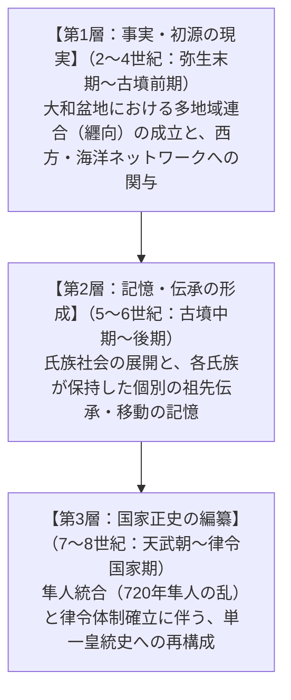

# 序章　なぜ皇祖は余所者なのか

## 1　邪馬台国の影と王権成立論争

日本の古代史において、これほど人々の想像力を掻き立て、百家争鳴の議論を巻き起こしてきたテーマはないだろう。「ヤマト王権はどこで、どのようにして生まれたのか」という問いである。

この論争の出発点には、常に「邪馬台国」の影が差している。三世紀の中国史書『三国志』魏書東夷伝倭人条――いわゆる『魏志倭人伝』に描かれた女王・卑弥呼の都は、果たして近畿（畿内）にあったのか、それとも九州にあったのか。

いわゆる「畿内説」と「九州説」の対立である。もちろん、諸説は百出しており、東遷説（九州にあった邪馬台国あるいはその一派が東へ移動して畿内ヤマト王権となったとする説）を含め、現在に至るまでアマチュアから専門の研究者までを巻き込んだ激しい議論が続いている。

しかし、近年の考古学的な発掘成果を冷静に眺めるならば、天秤は大きく一方へと傾きつつある。奈良盆地の東南部、三輪山の麓に広がる「纒向（まきむく）遺跡」の調査である。三世紀初頭という極めて早い段階において、この地には列島各地の土器が一堂に会する都市的な巨大拠点が突如として出現し、三世紀中葉には定型化された初期前方後円墳の代表格である箸墓（はしはか）古墳が築造された。

大和の地で、多地域の首長たちが結集し、初期ヤマト王権の骨格が形成された――。考古学的な物質証拠を虚心に見つめる限り、初期ヤマト王権の政治的中枢が大和にあったとする理解は、今日もっとも堅実かつ自然な結論である。

他方で、素朴な「九州説」――すなわち、北部九州や南九州に存在した強大な軍事国家が東へ進軍し、大和の先住民を武力で征服してヤマト王権を樹立したというシナリオ――は、考古学的には極めて支持しにくい。三世紀から四世紀にかけて、九州の物質文化（土器や墳墓形式、青銅器など）が大和を席巻した形跡は見当たらないからである。

このように、考古学のメスを入れる限り、「ヤマト王権は大和で成立した」と考えるのが極めて妥当であるように思われる。

だが、ここで立ち止まらなければならない。もしそうであるならば、私たちはある「異様な謎」に直面せざるを得ないからである。

## 2　大和王権なのに、大和出身ではない王家

その謎とは、ほかならぬ大和の王家自身が編纂した公式の歴史書――八世紀初頭に成立した『古事記』や『日本書紀』（記紀）の記述そのものにある。

記紀を開くと、私たちは奇妙な事実に突き当たる。

ヤマト王権の大王（天皇）家の祖先は、大和で生まれていないのである。

天照大御神（あるいは高皇産霊尊）の命を受けて天から降り立った天孫・邇邇芸命（ニニギノミコト）が降り立ったのは、三輪山でもなければ、伊勢でもなく、出雲でもない。はるか西方の辺境、「竺紫（つくし）の日向（ひむか）の高千穂」であった。

ニニギは南九州の地で、土地の首長神の娘である「神阿多都比売（カムアタツヒメ）」（木花之佐久夜毘売）を娶る。その子である火遠理命（ホオリノミコト／山幸彦）は、海洋の神・綿津見神（ワタツミ）の娘である豊玉毘売（トヨタマヒメ）を娶り、さらにその子が鵜葺草葺不合命（ウガヤフキアエズノミコト）となり、その末子として神倭伊波礼琵古命（カムヤマトイワレビコノミコト）――のちの神武天皇が誕生する。

そして神武は、壮年になってから「天下を治めるにふさわしい地」を求めて日向を発ち、瀬戸内海を船で東へと進み、数々の苦難を経て大和の地へと辿り着き、在地勢力を平定して初代天皇として即位したとされる。

これは実に奇妙ではないだろうか。

もしヤマト王権が大和の土着勢力から自然発生的に成長した国家であるならば、なぜ王家自身が残した建国神話は、自らのルーツを「大和の外」、それも遠く離れた九州南部の山海に設定したのだろうか。

「自分たちの祖先は太古からこの豊かな大和の盆地に君臨していた」と語る方が、王権の正当性を主張する上でどれほど都合がよく、自然であったことか。にもかかわらず、記紀神話は執拗なまでに、皇祖の出自を「大和の外」へと押し出している。

大和本拠の王権が、なぜ自らを「余所者（よそもの）」として描かなければならなかったのか。この問いこそが、本書のすべての出発点である。

## 3　神武東征という異様に具体的な物語

この謎を深めているのが、いわゆる「神武東征」物語が帯びている、異様なまでの具体性である。

神話や伝説の常として、荒唐無稽な神々の跳梁跋扈を描くだけであれば、地理的リアリティなど必要ないはずである。ところが神武東征の航路は、驚くほど緻密かつ現実的な瀬戸内海航路の要衝をなぞっている。

『古事記』によれば、神武一行の旅程は以下の通りである。

- 日向を出立
- 豊国の宇沙（大分県宇佐市）に滞在
- 筑紫の岡田宮（福岡県北九州市・遠賀川河口付近）に一年滞在
- 阿岐国の多祁理宮（広島県府中町付近）に七年滞在
- 吉備国の高島宮（岡山県岡山市・児島湾付近）に八年滞在
- 難波（大阪湾）へ突入、浪速の渡を経て生駒山越えを試みる
- 登美の豪族・長髄彦（ナガスネヒコ）の抵抗に遭い敗北、兄の五瀬命（イツセノミコト）が負傷（のちに戦死）
- 船で紀伊半島を迂回し、熊野へ上陸
- 八咫烏（ヤタガラス）の先導により吉野の山岳地帯を越えて大和盆地へ侵入
- 磯城の在地首長（兄磯城・弟磯城）や長髄彦を撃破し、橿原宮で即位

神武一行は、風待ち・潮待ちをしながら瀬戸内海を東進し、行く先々の有力勢力と接触し、時に数年間逗留して軍備や補給を整えている。この移動の方向性、滞在期間、そして最初に正面から大和盆地へ侵入しようとして撃退され、南の熊野・吉野山中へと大きく迂回するという戦術的挫折のリアリズムは、単なる机上の空想で作られた神話の域を明らかに逸脱している。

しかし、前述の通り、南九州の大国が大和を軍事征服したという考古学的証拠はどこにも存在しない。物質文化の連続性は完全に断ち切られているのだ。

荒唐無稽な完全な作り話と断じるには地理的・戦術的記憶がリアルすぎる。だが、文字通りの史実と信じるには物質的証拠がなさすぎる。

この二つの断崖の間に、どのような歴史の真実が隠されているのだろうか。

## 4　世界史的視座：なぜ王は「外部」から来るのか

ここで視界を日本列島の内側から、世界史と宗教学・人類学の地平へと広げてみよう。実は、「王権の始祖が外部からやって来た余所者である」という神話構造は、世界各地の王権形成史において決して珍しいものではない。

著名な人類学者マーシャル・サーリンズは、ポリネシアやフィジーをはじめとする環太平洋諸社会の研究から、**「外来王（Stranger-King）」**という極めて魅力的な概念を提起した。

部族社会や首長制社会において、複数の在地氏族が激しく競合しているとき、その内部の特定の家から王（支配者）が立ち上がると、必ず「なぜあいつの家系が我々の上に立つのか」という不満と嫉妬が噴出し、血で血を洗う内乱が終息しない。

そのようなとき、真の調停者・至高の支配者として迎えられるのは、むしろ**「外部からやって来た貴種（ストレンジャー）」**なのである。

外来の王は、在地のどの派閥にも属していない。だからこそ、在地氏族間の利害を超越した「中立的で絶対的な審判者」として機能することができる。そして外来王は、土地の最有力首長の娘を正妻として娶ることで、土地の霊力（在地権力）と外部の軍事・宗教的権威（超越性）を一身に統合し、新たな支配体制を確立するのである。

この「外来王」のモデルは、ギリシャ神話におけるテセウスやオイディプス、あるいはイギリスのアカデミズムにおけるアングロ・サクソンやノルマン人の征服王朝の記憶、さらには古代ローマの建国神話（トロイアからの亡命者アイネイアスの子孫がローマを拓いたとする伝承）にも通底している。

大和盆地という狭い空間の中で、三輪、葛城、物部といった強力な在地古豪たちがひしめき合っていた初期ヤマト社会を想像してみよう。その中で、一つの王家がすべての首長の上に君臨するためには、「自分たちも大和の一豪族にすぎない」と語ることは、むしろ致命的な弱点になり得たのではないか。

自らを「外部から天命を帯びてやって来た者」として位置づけること――それは、古代王権が在地性を脱ぎ捨て、普遍的で超越的な至高権力を確立するために獲得した、普遍的な神話装置だったのではないだろうか。

## 5　本書の仮説と三つの時代層

ここから、本書が提起する核心的な仮説が導き出される。

神武東征や日向降臨の神話は、「南九州国家による大和の軍事征服」というような**国家規模の集団移動**ではない。

それは、**「一族・婚姻・祭祀系統の移動」**という、はるかに小さな、しかし確かな歴史の記憶に基づいていたのではないか。

初期ヤマト王権の形成期（三〜四世紀）、西日本の広大な海上ネットワークを通じて、南九州や瀬戸内の海洋世界と結びついた特定の一首長家（あるいは婚姻関係を結んだ小集団）が大和の首長連合へと参入した。その小さな「外来の記憶」が、数世紀後の国家統合の時代において、巨大な建国神話へと結晶化したのではないか――。

この仮説を検証するにあたり、本書では**三つの時間層（レイヤー）**を厳格に峻別する。古代史の議論がしばしば混乱するのは、二世紀の弥生社会の前提を七世紀の律令国家に持ち込んだり、逆に七世紀の「万世一系」「天皇専制」という完成されたイデオロギーで二〜三世紀の王権を逆算してしまったりする「時代錯誤（アンクロニズム）」に原因があるからだ。

本書が設定する三つの時代層は以下の通りである。

- **【第1層：事実・初源の現実】（二〜四世紀：弥生末期〜古墳前期）**
  弥生末期の地域間抗争から、纒向を中心とする初期ヤマト王権の出現。吉備、東海、北陸、九州などを巻き込んだ連合政権の中で、のちに大王家となる勢力がいかなるネットワークを持っていたのか。
- **【第2層：記憶・伝承の形成】（五〜六世紀：古墳中期〜後期）**
  巨大前方後円墳が築かれた雄略天皇らの時代。氏族制が発達し、吉備氏、阿曇氏、物部氏、出雲氏などの諸豪族が、自らの出自や大王家への奉仕の由緒を語り始めた時代。
- **【第3層：国家正史の編纂】（七〜八世紀：天武・持統朝〜律令国家期）**
  壬申の乱を経て天皇権力が頂点に達し、白村江の敗戦に伴う国家防衛と律令法制が導入された時代。とりわけ、南九州の「隼人」が国家の重大な統治問題（七二〇年の隼人の乱）として浮上したこの時代に、『古事記』『日本書紀』は最終的に編纂された。

「史実か、創作か」という不毛な二項対立を越えて、第1層の小さな記憶が、第2層の氏族伝承を経て、いかにして第3層の国家イデオロギーへと変容を遂げたのか。

歴史学、考古学、神話学、宗教学の知見を交差させながら、大和と日向をめぐる壮大な記憶の旅へと出発することにしよう。
