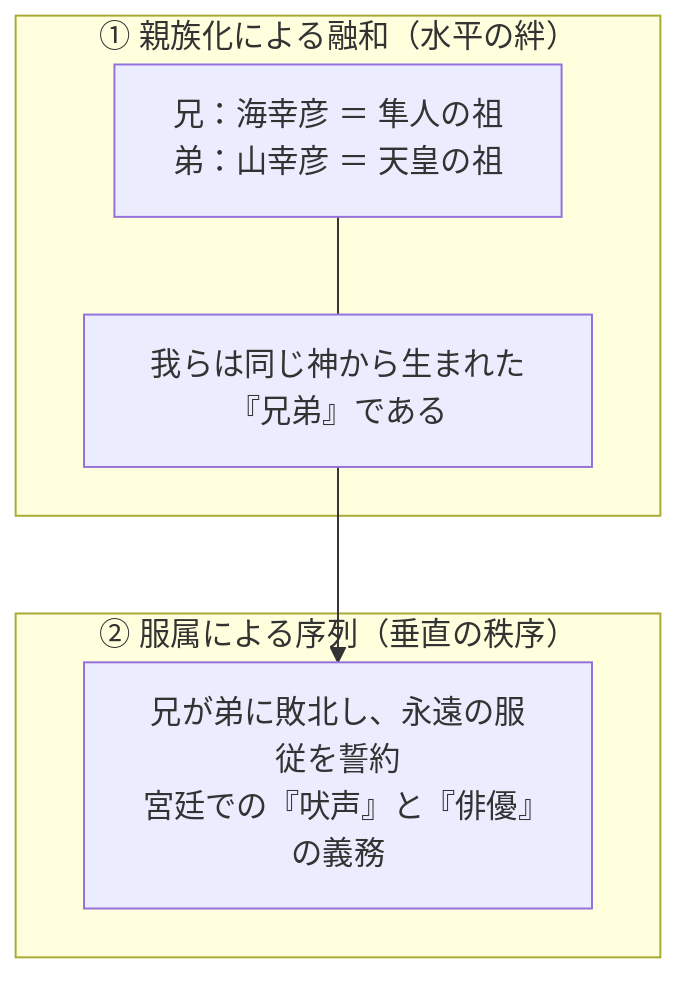

# 第十章　隼人統合と「皇祖の日向」

## 1　7〜8世紀、南九州が国家の現在問題になる

神話の霧が晴れ、生々しい公文書と年代記の文字が歴史の舞台を照らし出す七世紀末から八世紀初頭――。

この時代、南九州はヤマトの朝廷にとって、神話の追憶の地などでは決してなく、**国家の存亡と国境防衛に直結する「もっとも深刻な現実問題」**として浮上していた。

白村江の戦い（六六三年）で唐・新羅の連合軍に大敗したヤマト政権は、国家の総力を挙げて中央集権的な律令国家の建設を急いだ。律令国家とは、戸籍を作り、すべての民に口分田を割り当て（班田収授）、厳格に税（租庸調）を徴収し、軍役を課す徹底的な官僚支配システムである。

この容赦ない支配の網は、列島の南西端・南九州にも投げかけられた。

大宝二（七〇二）年、朝廷は薩摩半島を「薩摩国」として建国し、さらに和銅六（七一三）年には大隅半島を「大隅国」として日向国から分割・新設した。南九州の地に国府が置かれ、畿内から中央貴族が国司として派遣され、土地の丈量と戸籍の作成が強行された。

しかし、外洋の交易と独自の死生観に生きてきた南九州の在地首長や民――律令国家によって**「隼人（はやと）」**と総称された人々――にとって、それは自らの誇りと生活を根本から踏みにじる暴力的な侵略にほかならなかった。

緊張はついに極限に達し、大爆発を起こす。

**養老四（七二〇）年二月、「隼人の大反乱」の勃発**である。

大隅国の隼人たちが一斉に蜂起し、初代大隅国司であった陽侯史麻呂（やこのふひとしまろ）を襲撃して惨殺したのである。

国家の威信を揺るがす事態に、平城京の朝廷は震撼した。朝廷は直ちに当代一流の貴族であり武人であった中納言・大伴旅人（おおとものたびと）を「征隼人持節大将軍」に任命し、九州各地から一万人を超える大軍を徴発して南九州へと進発させた。

戦争は、南九州の険しい山岳と頑強な山野の城塞（曽於乃石城など）に籠もる隼人たちの抵抗によって泥沼化し、鎮圧までに一年半の歳月を要した。翌養老五年（七二一）に戦争が終結したとき、討ち取られた隼人の首級と捕虜の数は、実に一千四百余人に達していた（『続日本紀』）。

南九州は、文字通り血塗られた修羅場と化していたのである。

## 2　なぜこの時代に日向神話が重要になるのか

ここで、古代史研究者・原口耕一郎氏の画期的な指摘（『隼人と日本書紀』）に耳を傾けなければならない。

それは、**この隼人の大反乱が起きた養老四年（七二〇年）という年こそが、他ならぬ『日本書紀』三十巻が完成し、元正天皇へと奏上されたまさにその年であった**という、戦慄すべき時間的符合である。

平城京の宮廷で、書記官たちが『日本書紀』の神代巻を最終的に清書し、「天孫ニニギが日向に降り立ち、神武天皇が日向から出立した」という壮大な建国史を国家の正史として結実させていたその同じ月に、南九州では国司が殺害され、一万の征討軍が日向・大隅へと出陣していたのである。

これを単なる「偶然の一致」として片付けることができるだろうか。

断じて否である。

南九州が国家統治の最大の焦点となっていたこの時代だからこそ、**「皇祖の故郷は日向である」という神話が、国家にとってもっとも切実な政治的機能を帯びて立ち現れてきた**のである。

もし、ヤマト国家が南九州を単なる「無関係な異民族の土地」として力づくで蹂躙したならどうなるか。現地の人々の怨恨は未来永劫に消えず、叛乱の火種が永遠にくすぶり続けることになる。

そこで朝廷が掲げたのが、日向神話という巨大な政治的イデオロギーであった。

「大和の国家は、お前たちを外部から侵略しに来た異民族ではない。大和の天皇の祖先こそが、他ならぬお前たちのこの日向の大地に天降り、この海と山の神々を娶って生まれたのだ」

征服の暴力性を覆い隠し、南九州と大和の王権を「神代からの宿命」によって結びつけること。日向神話が記紀においてこれほどまでに重厚に語られた背景には、この同時代の隼人統合という過酷な政治的要請が、決定的な推進力として働いていたのである。

## 3　融和と序列を同時に実現する神話

この政治的意図がもっとも精巧に結実したのが、第五章で見た「海幸彦・山幸彦神話」の結末であった。

この神話の構造を、改めて解剖してみよう。

第一に、神話は隼人の祖（海幸彦）と天皇の祖（山幸彦）を「実の兄弟」として描く。

これは強烈な**「親族化（融和）」のメッセージ**である。お前たちは赤の他人ではない。我々と同じ天孫ニニギの血を分けた、尊い兄弟なのだと語りかける。

しかし第二に、その物語の結末において、兄は弟の神宝の前に完全に屈服し、「私はあなたの昼夜の守護人となって仕えましょう」と誓わされる。

ここで、親族としての水平の絆は、瞬時にして**「永遠の主従関係」という垂直の序列**へと固定される。

この神話的約束事は、律令国家の宮廷儀礼の中に厳密に制度化された。

大和の朝廷には「隼人司（はやとのつかさ）」という専門官庁が置かれ、南九州から貢進された隼人たちが配属された。そして元日の朝賀や即位の儀礼において、隼人たちは朱色と白色で染められた独特の盾（隼人盾）を持ち、竹笠をかぶり、天皇の御座の前で犬の遠吠えを模した「吠声（ほえごえ）」を一斉に張り上げ、水に溺れる無様な姿を演じる「俳優（わざおぎ・隼人舞）」を披露することを義務付けられたのである。

神話が語る「兄の服従の誓い」が、毎年の宮廷儀礼として、何百人もの生身の隼人たちの身体を通じて反復・上演（パフォーマンス）された。

神話と国家儀礼が完璧に同期し、南九州の服属を「神代からの不変の掟」として可視化したのである。

## 4　南九州側にもメリットがある

こうした儀礼は、現代の私たちの目には、被征服者に対する残酷な屈辱の強要のように映るかもしれない。

しかし、古代の統治関係を一方的な被害・加害の二元論だけで捉えるのは、歴史の複雑さを見誤ることになる。実はこの神話的包摂は、**南九州の首長たちにとっても、ある種の政治的メリットを内包していた**のである。

比較のために、当時のもう一つの辺境であった東北地方の「蝦夷（えみし）」に対する国家の眼差しを見てみよう。

朝廷は蝦夷を「毛人」と呼び、「獣の心を持ち、言葉も通じぬ野蛮人」として徹底的に他者化・野蛮視した。彼らには神代の神話における親族の席など一切与えられず、ただ教化し、征討すべき対象として扱われた。

それに引き換え、隼人の置かれた位置はどうであったか。

彼らは「皇祖の兄の直系の子孫」であり、「天孫の正妻・神阿多都比売の血を受け継ぐ民」として国家の正史に堂々と位置づけられたのである。

天皇の宮廷の最前線で邪気を祓う「吠声」を上げ、呪術的な芸能を奉仕することは、国家の秩序維持に不可欠な「神聖なる特権的職務」でもあった。朝廷に服属した隼人の首長たちは、隼人司の官人に任ぜられ、中央の威光と富を郷里へと持ち帰るパイプを獲得したのである。

大和の王権は、南九州を力で叩き潰して奴隷にしたのではない。

彼らに「皇祖の親族」という名誉ある席次をパンテオンの中に与え、宮廷儀礼の中に不可欠な聖なる役割を割り振ることで、**「内なる他者」として国家の中枢へ巧妙に包摂した**のである。

征服の暴力と、神話による抱擁。

この二つが同時に作動したとき、皇祖が降り立った「日向」の地は、国家にとって決して手放すことのできない聖域として完成した。

そして、この南九州の血塗られた平定のドラマは、豊前の地に座す、もう一つの巨大な神を歴史の表舞台へと押し上げることになる。

八幡神の登場である。
