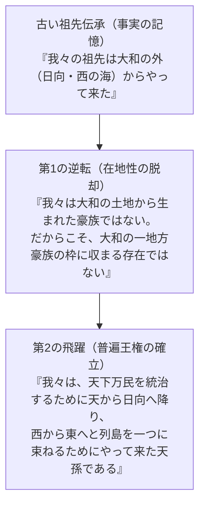

# 第十二章　天武天皇たちは何を書き換えたのか

## 1　各氏族にはそれぞれの歴史があった

七世紀の後半、日本列島は古代史上最大の内乱に揺れ動いた。天智天皇の死後に起きた後継者争い――**「壬申の乱（六七二年）」**である。

大海人皇子（おおあまのおうじ）は吉野を脱出し、東国（美濃・尾張など）の軍事力を動員して近江朝廷を急襲・壊滅させ、飛鳥浄御原宮（あすかきよみはらのみや）において「天武天皇」として即位した。

この内乱の勝利者となった天武天皇が目指したのは、それまでの有力豪族（蘇我氏、物部氏、葛城氏など）による合議制や権力争いを徹底的に排除し、天皇とその皇子たちだけが絶対的な統治権を握る「皇親政治（こうしんせいじ）」の確立であった。

そして、この絶対的権力を正当化するために天武天皇が着手したのが、**国家の公式歴史書の編纂**であった。

『古事記』の序文には、天武天皇が下した有名な詔（みことのり）が記されている。

> 「朕聞く、諸家の赍（も）てる帝紀（ていき）及び本辞（ほんじ）、既に正実に違ひ、多く虚偽を加ふと。……此れ其の緒（もと）を改め正さずば、年を経ずして其の旨滅びなむとす。是れ乃ち、邦家の経緯（たてぬき）、王化の鴻基（こうき）なり。故惟れ、帝紀を撰録し、旧辞を討覈（とうかく）して、偽りを削り実を定めて、後葉（のちのよ）に流（つた）へむと欲ふ」

ここで天武が語っている不満に注目してほしい。

当時、大和の有力な諸氏族（「諸家」）は、それぞれ自前の歴史書――歴代大王の系譜を記した『帝紀』や、自らの氏族の武勇と由緒を誇る伝承『本辞（旧辞）』を持っていた。

物部氏には物部氏の、吉備氏には吉備氏の、出雲氏には出雲氏の、阿曇氏には阿曇氏の「それぞれの歴史」があり、それぞれの祖神が主役を演じる多声的な神話世界が列島に溢れかえっていたのである。

天武天皇の目には、この多様性こそが「虚偽」であり、天皇専制を阻む危険な火種と映った。

## 2　国家は歴史を一つにする

天武天皇が断行したのは、**「国家による歴史の独占と一本化」**であった。

各地の豪族たちが勝手に語り伝えていたバラバラの祖先伝承を集め、「偽りを削り実を定める」という名目のもとに、すべてを**「天照大御神から始まる一本の皇統史」**へと再編成・秩序化する大事業である。

稗田阿礼（ひえだのあれ）に伝承を暗誦させ、太安万侶（おおのやすまろ）に筆録させた『古事記』（七一二年完成）。
そして舎人親王（とねりしんのう）らが中心となって編纂した国家正史『日本書紀』（七二〇年完成）。

この二大歴史書の成立によって、それまで競合し合っていた諸豪族の歴史は、天皇家の正統性を引き立てるための「脇役」として、厳格に再配置された。

そして、この壮大なる再編集の現場において、もっともドラスティックな、奇跡的とも言える**「神話的逆転劇」**が仕掛けられたのである。

それこそが、「皇祖の余所者伝承」の書き換えであった。

## 3　「余所者」という祖先伝承の大逆転

第七章で指摘したように、初期の大王家が保持していたであろう古い伝承――
**「我々の祖先は、西の海（日向・南九州）からやって来た」**
という記憶は、大和盆地においては本来、在地古豪に対する「最大の弱点」であった。

三輪山に君臨する大神氏や、葛城の沃野を握る葛城氏に向かって、「自分たちは西から来た余所者だ」と主張することは、「自分たちは大和において後発の新参者にすぎない」と白状するに等しかったからである。

ところが、天武天皇とその知性ある編纂官たちは、この弱点を隠蔽して大和出身のふりをするという安易な道を選ばなかった。

彼らは、この「余所者であること」を梃子（てこ）にして、**まったく新しい、前代未聞の権力イデオロギー**を発明したのである。

その論理の飛躍（ロジック）は、驚くほど鮮やかである。

1. **「我々の祖先は大和の外からやって来た」**
2. **「だからこそ、我々は大和の一地方豪族ではない」**
3. **「大和の豪族がどれほど古くからその土地にいようと、彼らは所詮『大和という一地域の土着民』にすぎない」**
4. **「それに対して大王家は、天から日向へ降り、西から東へと列島を統べ、天下をあまねく治めるために外部からやって来た『至高の普遍王権』なのだ」**

弱点が、最大の強みへと反転した瞬間である。

「余所者であること」は、もはや恥ずべき出自の低さではなく、**「あらゆる在地氏族のローカルな利害を超越した、絶対的な正統性の根拠」**へと昇華されたのである。

## 4　物部・三輪・葛城とどんぐりの背比べだった時代

この神話的転換の凄まじさは、当時の畿内の政治闘争に身を置いてみればより痛烈に理解できる。

もし大王家が、「大和盆地で一番古い家は誰か」というルールの下で物部氏や三輪氏、葛城氏と競争を続けていたならば、彼らは永遠に「どんぐりの背比べ」から抜け出すことはできなかった。

「お前の家が大和に来る前から、我らはこの三輪山を祀っていた」
「葛城の土地を開いたのは我が祖先だ」

そう反論された瞬間、大王家の権威は失墜する。

だからこそ、天武天皇たちは**「競争のルールそのものを根底から変えてしまった」**のである。

土着の古さを競い合う泥沼のチキンレースからさっさと降り、
「我らはそもそも大和の土から生まれた者ではない。天照大御神の命を受けて高天原から日向へ降り立ち、列島を一つにするために東征してきた外来の神孫なのだ」
という、まったく別の次元の物語を提示したのだ。

この論理の前には、三輪氏も葛城氏も物部氏も、すべて「大和の地で外来の王を迎え入れ、ひれ伏すべき臣下（国津神）」へと格下げされるしかなかった。

神話の土俵を大和から「日向」へ、そして「天（高天原）」へと一気に引き上げることで、大王家はすべての在地豪族を決定的に置き去りにし、唯一無二の至高の頂へと跳躍したのである。

## 5　神武東征という政治的発明

歴史学者エリック・ホブズボウムらは、名著『創られた伝統』の中で、近代国家が自らの正統性を確立するために、いかに「太古からの伝統」を巧妙に発明（再構成）してきたかを暴いた。

天武朝における神武東征神話の完成とは、まさに七世紀末の日本列島において起きた**「創られた伝統」の決定打**であった。

もちろん、それは何もない虚空からでっち上げられた嘘ではない。

そこには、二〜四世紀の西日本を舞台に繰り広げられた、南九州や海人集団との婚姻・移住という「確かな歴史の記憶（第1層）」があった。そして、五〜六世紀の氏族たちが語り継いできた個別の英雄伝承（第2層）があった。

編纂者たちの天才は、その過去の生きた記憶を素材として巧みに掬い上げながら、それを**七〜八世紀の律令国家と天皇専制を正当化するための「普遍の建国叙事詩」へと再編集（第3層）したこと**にあったのである。

日向から大和への移動という方向性（ベクトル）は、かつて一族が辿った旅路の記憶であったかもしれない。

しかし、それが「天下をあまねく平らかに治めるための神聖なる東征」という壮大な帝国神話へと意味づけを変えられたとき、日本列島にはまったく新しい王権のイデオロギーが誕生した。

神武東征とは、過去の戦争の記録ではない。

それは、大和の王権が自らの出自の弱点を克服し、すべての地域と氏族を足元に従えるために成し遂げた、**日本史上最大の「政治的発明」**だったのである。

そしてこの統治の知恵は、列島各地の神々に対しても遺憾なく発揮されていくことになる。

次章、中央の神話が各地の在地信仰をいかに「解釈」し、呑み込んでいったのか、その具体例を追うことにしよう。
